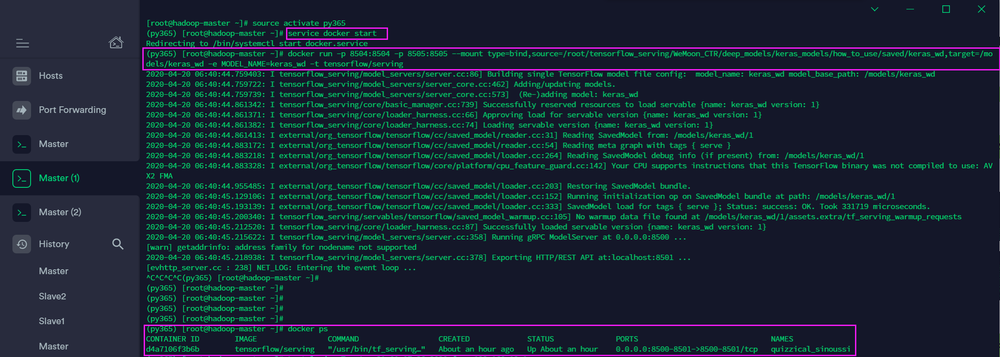
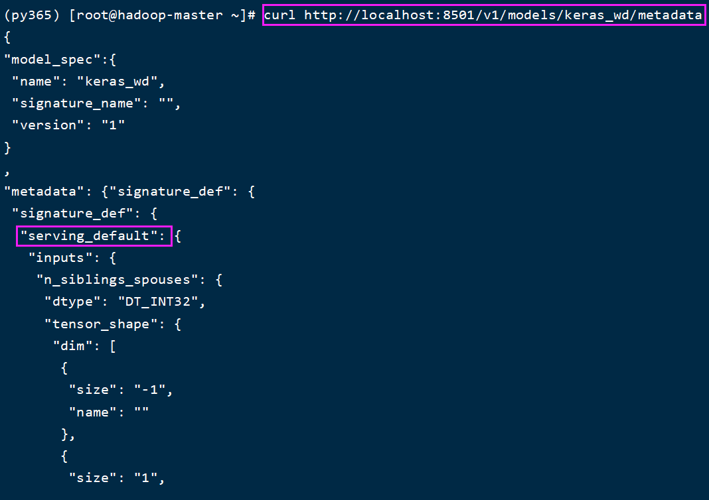
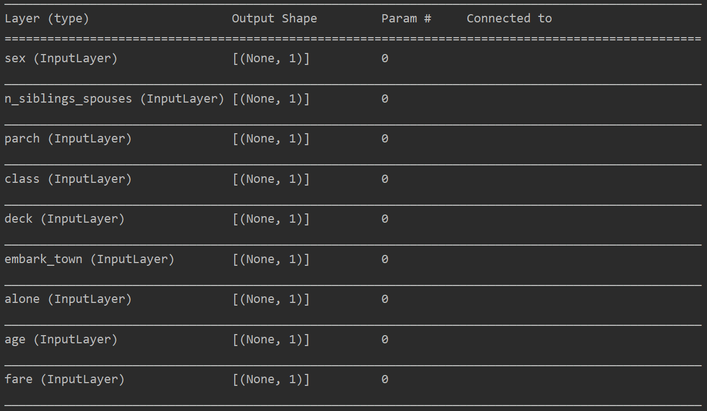

### A Demo for  Online TensorFlow Serving models deployment

You need to build your Linux Server Cluster, which have Docker installed. if not, you can reference  this [site](https://hub.docker.com/r/bitnami/tensorflow-serving) to build one!

For example,  I wanna take a trained wide&deep model(based on tensorflow) to online service, please fellow the below steps:

1. Start the docker:  service docker start 
2. Install TensorFlow Serving in Docker: pull tensorflow/serving:latest
3. Run the Docker:

docker run -p 8501:8501 -p 8500:8500 --mount type=bind,source=/root/tensorflow_serving/keras_wd,target=/models/keras_wd -e MODEL_NAME=keras_wd -t tensorflow/serving

4. Check the model is running on Docker correctly: docker ps

Refer to the picture:

5. Please make sure your trained model on serving is available: 

curl http://localhost:8501/v1/models/keras_dw

{

 "model_version_status": [

  {

   "version": "1",

   "state": "AVAILABLE",

   "status": {

​    "error_code": "OK",

​    "error_message": ""

   }

  }

 ]

}

6. At mean time, you can check the metadata, too!

curl http://localhost:8501/v1/models/keras_dw/metadata

There is a important detail, you must know about it before going to testing! The inputs structure of  your trained model, see the picture for your reference:

7. Ok, the next step is going to test:

curl -X POST http://localhost:8501/v1/models/keras_dw:predict -d '{ "instances":[0, 0.26813880126182965, 0, 0, 0.015126992566498259, 2, 7, 2, 1]}'

 Then you will get the response from the online tensorflow serving:

{

​    "predictions": [[0.927172563]]

}

If there are some problems in deployment, please contact with me!

Wechat: ziqingxiansheng